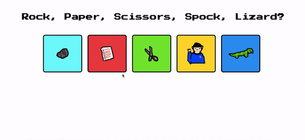

## Goal
 Create a Rock, Paper, Scissors, Lizard, Spock game using es6 and served by a simple node server (http module). The user should select R,P,SC,L,SP and their answer should be compared with the computer's selection in order to decide a winner. 

## How it's made
Made using HTML, CSS, Javascript, Node.js, JSON. 

## What I've learmed
I've learned a lot about client-side and server-side Javascript and feel pretty comfortable deciphering what goes where now. 
